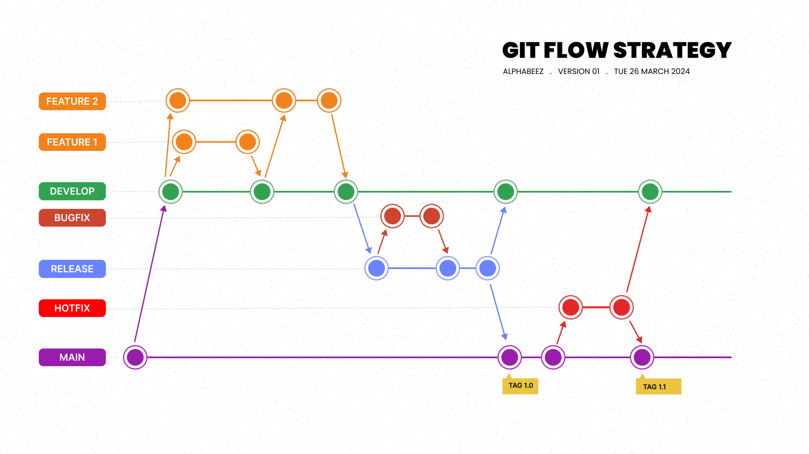

# Clone-Apple-Project

Link to Website(https://www.apple.com/)

## Getting started

* Reason for doing this project :
1. Further Learning , explore and practice what have been learn from Udemy courses.
2. Building up portfolio.
3. Learn the process of how a website is build.

## Tools:

1. HTML (HyperText Markup Language):
- Standard language for making the Website.
2. CSS :
- Use for styling the html.
3. Tailwind :
- A design system use for implement pure CSS. Built-in class to use and had it own CSS style.
4. Flowbite :
- An open source library of UI component and capatible with tailwind.
5. ECMAScript(Javascript) :
- An object oriented language that developer use to make the web pages interactive.
***

# Component

1. Home-Page :
- Carousel
- Infinite Scroller
2. Accessories-Page :
- Pin Wheel Carousel
- Populator for each Pin Wheel and the inside items
- Tab for product and catergory.
3. Support-Page :
- Responsive image.
4. Navigation bar :
- navbar-component 
- Mouse enter and Mouse leave dropdown content.
5. Footer :
- footer-component
- Accordion
- Populator for each accordion items. 

## Git-Flow strategy

## Contributing

Name Contributor : 
Khom Khit (Developer)
Team alphabeez member (Peer review)
