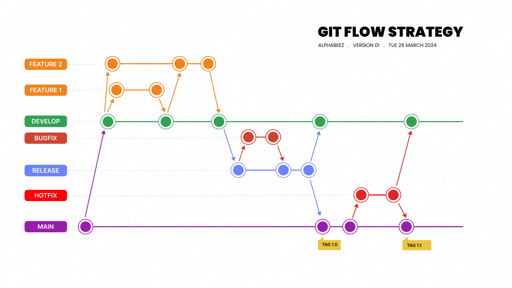

# Clone-Apple-Project

Link to Website(https://www.apple.com/)

## Getting started

* Reason for doing this project :
1. Further Learning , explore and practice what have been learn from Udemy courses.
2. Building up portfolio.
3. Learn the process of how a website is build.

## Tools:

1. HTML (HyperText Markup Language):
- 
2. 
***

# Component

1. Home-Page :
2. Accessories-Page :
3. Support-Page :

## Obstacle

1. 

## Git-Flow strategy

## Contributing

Name Contributor : Khom Khit

